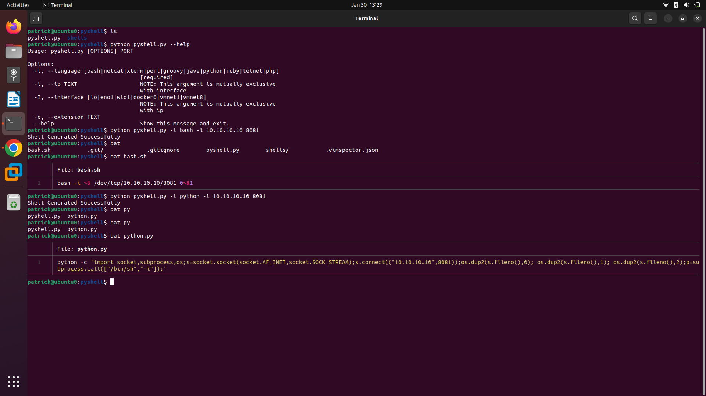

# Shallow-Installation
1. clone the git repository using the command 'git clone https://github.com/whitecat1331/pyshell.git'
2. Install dependencies running the command 'pip install -r requriements.txt'
2. Once the repository is installed or downloaded, run the command 'python pyshell.py --help' for help
# Examples:
- python pyshell.py --help
- python pyshell.py -l bash -i 10.10.10.10 8081
- python pyshell.py -l python -I eth0 7111

